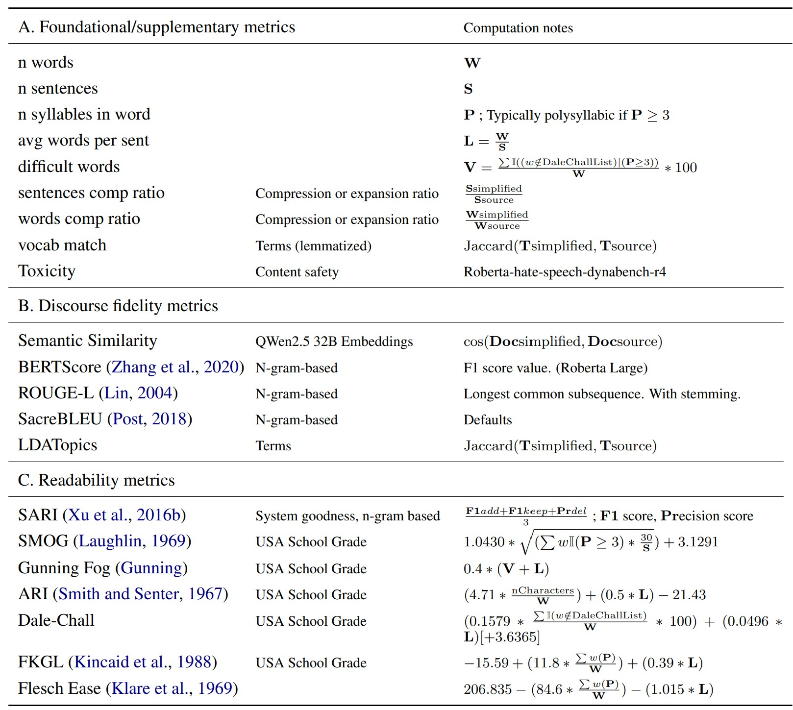

 
 
[](https://github.com/bilha-analytics/text-simplification-metrics-eval/tree/main/analysis_output)

# Summary


## Pages (detailed results)

- **[Analysis Output: Readability and accuracy metrics, Instruction-tuned Mistral-small 24B Vs Reasoning-augmented QWen2.5 32B](https://github.com/bilha-analytics/text-simplification-metrics-eval/tree/main/analysis_output)**


## Metrics in the analysis 

<p align="center">
  
  <br>
  <em>Figure 1: Metrics in the evaluation</em>
</p>

<!--
| Metric     |                                | Computation notes                                                                                                                              |
|-------------------------------------------|--------------------------------|------------------------------------------------------------------------------------------------------------------------------------------------|
| n words                                  |                                | $\mathbf{W}$                                                                                                                                   |
| n sentences                              |                                | $\mathbf{S}$                                                                                                                                   |
| n syllables in word                    |                                | $\mathbf{P}$  ;   Typically polysyllabic if $\mathbf{P}\ge 3$                                                                                 |
| avg words per sent                     |                                | $\mathbf{L} = \frac{ \mathbf{W} }{ \mathbf{S} }$                                                                                               |
| difficult words                          |                                | $\mathbf{V} = \frac{ \sum \mathbb{I}( ( w \notin \mathrm{DaleChallList}) |  (\mathbf{P} \ge 3))  }{ \mathbf{W} }  * 100$                     |
| sentences comp ratio                    | Compression or expansion ratio | $\frac{\mathbf{S} {\mathrm{simplified}}}{\mathbf{S} {\mathrm{source}}}$                                                                        |
| words comp ratio                        | Compression or expansion ratio | $\frac{\mathbf{W} {\mathrm{simplified}}}{\mathbf{W} {\mathrm{source}}}$                                                                        |
| vocab match                              | Terms (lemmatized)             | $\mathrm{Jaccard} ( \mathbf{T} {\mathrm{simplified}} ,   \mathbf{T} {\mathrm{source}} )$                                                       |
| Toxicity                                  | Content safety                 | Roberta-hate-speech-dynabench-r4                                                                                                               |
|**2. Discourse fidelity/Accuracy**|  | | 
| Semantic Similarity                       | QWen2.5 32B Embeddings         | $\cos ( \mathbf{Doc} {\mathrm{simplified}}, \mathbf{Doc} {\mathrm{source}} )$                                                                  |
| BERTScore~\cite{zhangbertscore2020}       | N-gram-based                   | F1 score value. (Roberta Large)                                                                                                                |
| ROUGE-L~\cite{linrouge2004}               | N-gram-based                   | Longest common subsequence. With stemming.                                                                                                     |
| SacreBLEU~\cite{postcall2018}             | N-gram-based                   | Defaults                                                                                                                                       |
| LDATopics                                 | Terms                          | $\mathrm{Jaccard} ( \mathbf{T} {\mathrm{simplified}} ,   \mathbf{T} {\mathrm{source}} )$                                                       |
|**3. Simplification and readability**| | | 
| SARI~\cite{xuoptimizing2016}              | System goodness, n-gram based  | $\frac{ \mathbf{F1} {add}  + \mathbf{F1} {keep} + \mathbf{Pr} {del} } { 3 }$ ;  $\mathbf{F1}$ score, $\mathbf{Pr}$ecision score               |
| SMOG~\cite{smog}                          | USA School Grade               | $1.0430  *   \sqrt{  (\sum {w} \mathbb{I}(\mathbf{P} \ge 3)  * \frac{30}{\mathbf{S}}   }  )  + 3.1291$                                       |
| Gunning Fog~\cite{gunningtechniquenodate} | USA School Grade               | $0.4 * (  \mathbf{V}   +    \mathbf{L}  )$                                                                                                     |
| ARI~\cite{smithautomated1967}             | USA School Grade               | $(4.71 * \frac{\mathrm{nCharacters}}{\mathbf{W}}) +  (0.5 * \mathbf{L})  - 21.43$                                                             |
| Dale-Chall                                | USA School Grade               | $(0.1579 * \frac{  \sum \mathbb{I}( w \notin \mathrm{DaleChallList})    }{\mathbf{W}} * 100)   +  (0.0496 * \mathbf{L})  \space [+ 3.6365 ]$ |
| FKGL~\cite{kincaidelectronic1988}         | USA School Grade               | $-15.59  +  (11.8 * \frac{\sum {w}(\mathbf{P})}{\mathbf{W}})    + (0.39 *  \mathbf{L})$                                                     |
| Flesch Ease~\cite{klareautomation1969}    |                                | $206.835 - (84.6 * \frac{\sum {w}(\mathbf{P})}{\mathbf{W}} )   - (1.015 *  \mathbf{L} )$                                                     |
-->

Traditional lexical alignment metrics like ROUGE and SacreBLEU, while not ideal for text simplification due to their reliance on lexical retention, serve as foundational measures for internal consistency and cross-study comparability.
Implementations are based on $evaluate$ \cite{noauthor_huggingface/evaluate_2025} and $textstats$ \cite{noauthor_textstat/textstat_2025} Python modules.

## Example of text simplification
<p align="center">
  
  <br>
  <em>Figure 2: Example text simplification guidelines for annotators in benchmarking dataset (source: Kush Attal, et. al.)</em>
</p>


## Prompt Design

#### LLM prompt for text simplification
```md
SYSTEM PROMPT:		
You're a scientific research assistant in the field of biomedical engineering, and  with excellent public dissemination and communication skills. Your task is to transform medical and scientific text, parlance and jargon into a version that is easy to read and understand for a layman with basic high school education. Relative to this task, this is what it means to simplify a text; it is to translate it from scientific parlance and jargon into lay easy to read language. 
      
## INSTRUCTIONS
**Transform the scientific text into a version that is easy to read and understand for a layman**

1. **Your transformation operations work at a sentence level**. 
- You must operate at a sentence level. 
- For instance, a title text is already a sentence, while an abstract or a paragraph of text is not. A paragraph of text has multiple sentences, so you **MUST split paragraphs into a list of sentences first**, and index each sentence starting from `0` like one would a python list. 
- Therefore, if the input is a single sentence, operate on it directly. Else if it is a paragraph, first split it into its constituent sentences, then operate on each sentence at a time. 
- If the context a sentence belongs to is provided, consider that context only as a guide to help you better transform the sentence in question.
- That also means you cannot summarize a paragraph as that risks loss of meaning and information. **Each sentence in the original text must be accounted for**.  
      
2. **For each sentence, consider the following possible transformations** that might realise simpler sentences, that are easy to read and understand for a layman. 
- You may split a sentence into 2 or more sentences as part of the simplification transform. For instance, in the case of long complex sentences
- Identify medical and scientific parlance and jargon and substitute it with equivalent lay terms 
- Where equivalent lay terms are not available, consider providing an explanation or clarifying examples 
- If the scientific terms and phrases are too granular and a more generic/abstract form would suffice for a layman, and without loss of meaning, prefer the more general/abstract form/terms
- You may omit (transform entire sentence into an empty string) sentences that are intended for a scientific audience and whose removal does not alter the understanding of the meaning of the broader document text
- Prefer active over passive voice. 
- Add subheadings at the start of a sentences. For instance, "Aim:" can be added to an objective sentence, while "Results:" may be added to a findings/results sentence. 
- When providing quantitative results, remove scientific detaills such confidence intervals (CI), p-values, etc  
      
Other guidelines 
- **STRICTLY, DO NOT summarize the research or extract and transform texts that are not explicitly requested for in the input**
- **STRICTLY, DO NOT synthesize or summarize the text.** 
- **Your task and goals is to traslate from medical/scientific parlance and jargon into layman easy to read and understand language**.
                        
## OTHER GUIDELINES TO OBSERVE
- Be concise and succinct
- if you don't know don't not create/imagine facts
- use the string `**N/A**` for empty non-numeric values  and the number `-99` for empty numeric values if you must report a value and yet you don't know.
- Striclty adhere to the output format requested. Only extract and return as per the output format or JSON schema; no other detail!! 
- If JSON output is requested, return only valid json output AND as per the indicated format/schema. **Strictly return valid JSON output and as per indicated output JSON schema**, AND enclose the JSON output in a code block e.g "```json <only requested output as per output JSON schema goes here>```". 
      
      
      

USER PROMPT: 
## Text to transform
<input> {input_data} </input>
      
OUTPUT FORMAT:
{Output format representation of the Pydantic object}
```


#### Pydantic model for structured LLM output
```python
class PlabaSentence(BaseModel):
      index_of_input_sentence:Optional[int] = Field(None, description="A. The index of the sentence in the `input`/<input> text if the `input`/<input> text is a paragraph OR B. The index of a sentence in the `context`/<context> paragraph if the `input`/<input> text is a single sentence. The index of a sentence is its sequence number in the containing paragraph, and the first sentence is indexed 0, the sencond 1 and so on.")
      input_sentence:Optional[str] = Field(None, description="The original sentence, as provided by user in `input`/<input>, and which is to be simplified/transformed.")
      output_sentence:Optional[str] = Field(None, description="The new transformed/simplified sentence. It is okay to return the original sentence here if and only if the sentence does not need changing/simplification. This can also be an empty string if simplication entails complete omission of the sentence.")
      changes_made:Optional[List[SimplificationChange]] = Field(None, description="Strict list (at most 10) of distinct changes/transformations made to this sentence, if at all.")
      rationale:Optional[str] = Field(None, description="Brief summary, in under 30 words, of the rationale behind transforming that sentence in that manner.")

class PlabaDoc(BaseModel):
      list_of_requested_responses:Optional[List[PlabaSentence]] = Field(None, description="The list of simplified sentences. Each sentence in the `input`/<input> must be accounted for accordingly.")	
```

#### Pydantic model for capturing the rationale behind LLM response
```python
class SimplificationTransforms(Enum):
      SWAP_OUT_JARGON = "jargon/parlance swap"
      EXPLAIN_JARGON_OR_PHRASE = "explain jargon"
      SWAP_GRANULAR_DETAILS_FOR_GENERAL = "abstract granular"
      OMIT_UNECESSARY_SCI_DETAILS = "omit unnecessary"
      NO_CHANGE_NECESSARY = "no change necessary" 
      OTHER = "other"
            
class SimplificationChange(BaseModel):
      input_phrase:Optional[str] = Field(None,description="The original word or phrase as provided in the `input`/<input> text by the user.")
      update_phrase:Optional[str] = Field(None,description="The new/transformed version.") 
      update_type:Optional[SimplificationTransforms] = Field(None,description="kind of transformation/change it is.")
      update_rationale:Optional[str] = Field(None,description="Brief explanation, in under 30 words, for this particular change.") 
```


## Associated Publications 

```bibtex
@article{githinji2025textsimplificationmetricsgeneralpurpose,
      title={On Text Simplification Metrics and General-Purpose LLMs for Accessible Health Information, and A Potential Architectural Advantage of The Instruction-Tuned LLM class}, 
      author={P. Bilha Githinji and Aikaterini Meilliou and Zeming Liang and Lian Zhang and Peiwu Qin},
      year={2025},
      eprint={2511.05080},
      archivePrefix={arXiv},
      primaryClass={cs.CL},
      url={https://arxiv.org/abs/2511.05080}, 
}
```
