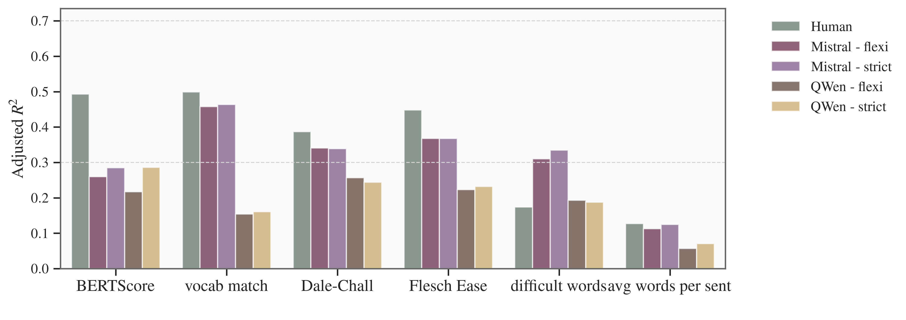
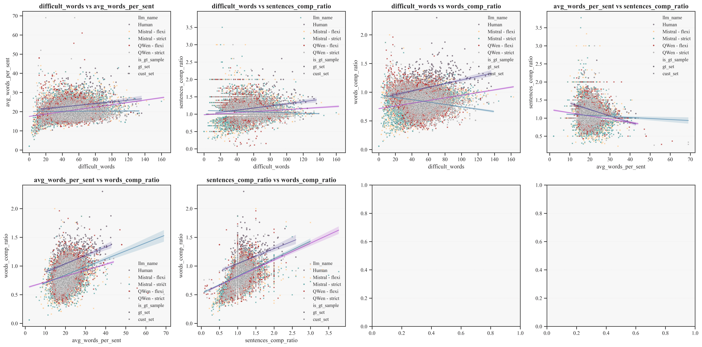

[](https://arxiv.org/abs/2511.05080v2)


# Summary


<p align="center">
  
  <br>
  <em>Figure 1: Summary of mean scores</em>
</p>


# Records
This GitHub repository hosts the analytical outputs from our study. Table 1 below lists the collection of CSV files. These data files support the findings discussed in our research and provide resources for reference. 

**Table 1: Overview of the CSVs with analysis output**
| File name                      | Description                             |   $n$ rows | Columns                                                                                                                                          |
|:-------------------------------|:----------------------------------------|:-----------------:|:-------------------------------------------------------------------------------------------------------------------------------------------------|
| human_benchmark_thresholds.csv | Mean scores for human benchmark.        |               22 | Model Name, Metric Name, mean, se, ci (.95)                                                                                                      |
| welch_tests.csv                | Welch's t-test results                  |              109 | Model Name, Metric Name, Benchmark mean ($\mu_1$), Model mean ($\mu_2$), Difference between means ($\mu_1 - \mu_2$), p value, Benchmark $n$ obs, Model $n$ obs |
| metric_means_se.csv            | Means scores for each of the LLM models |              109 | Model Name, Metric Name, mean, se, ci (.95)                                                                                                      |
| reg_pca.csv                    | OLS regression results                  |               12 | Model, Metric Name, Adj. R-squared:, R-squared:, F-statistic:, No. Observations:                                                                 |
 

---

**Table 2: SARI Scores**
| Model Name       |   mean |   se | ci (.95)      |   $n$ Documents |
|:-----------------|-------:|-----:|:--------------|--------------:|
| Mistral - flexi  |  42.46 | 0.3  | 41.86 - 43.05 |           606 |
| Mistral - strict |  42.37 | 0.3  | 41.77 - 42.96 |           606 |
| QWen - flexi     |  38.38 | 0.05 | 38.28 - 38.47 |           569 |
| QWen - strict    |  37.84 | 0.35 | 37.16 - 38.52 |           443 |


---

**Table 3: Number of samples used in the analysis**
| Dataset                  | Simplification Model   | $n$ Documents   |   Task Completion Rate | $n$ Evaluations   |
|:-------------------------|:-----------------------|:--------------|-----------------------:|:----------------|
| Benchmark                | human                  | 748           |                   1    | 26,926          |
| Benchmark as control set | Mistral - flexi        | 606           |                   0.81 | 15,322          |
| Benchmark as control set | Mistral - strict       | 606           |                   0.81 | 15,288          |
| Benchmark as control set | QWen - flexi           | 569           |                   0.76 | 13,533          |
| Benchmark as control set | QWen - strict          | 443           |                   0.59 | 11,182          |
| Custom set               | Mistral - flexi        | 3,218         |                   0.85 | 78,030          |
| Custom set               | Mistral - strict       | 3,217         |                   0.85 | 77,994          |
| Custom set               | QWen - flexi           | 3,672         |                   0.97 | 69,336          |
| Custom set               | QWen - strict          | 2,453         |                   0.65 | 59,340          |


A successful completion involves the transformation and return of a correctly formatted response for subsequent evaluation.
The instruction-tuned Mistral model maintains stable operational performance irrespective of the temperature configuration, attaining a completion rate of $85\%$ for the custom dataset.
Conversely, QWen exhibits sensitivity to temperature settings. 
All in all, reasonable sample sizes are obtained for subsequent interrogation.


 ---

**Regression by PCA analysis** 
We set a metric as an independent variable and then ran a regression model on the first four PCA components of the other metrics.

```latex
\begin{align*} 	 
  y = & \mathbf{PCA}(\mathrm{StandardScaler} ( X ) ) \\
  \\
  \mathrm{metrics} \in \big\{ &\mathrm{BERTScore}, \\
  & \mathrm{Dale Chall}, \\
  & \mathrm{Flesch Ease}, \\
  & \mathrm{avg\_words\_per\_sent}, \\
  & \mathrm{vocab\_match}, \\
  & \mathrm{difficult\_words} \big\}
\label{eq:pca} 
\end{align*}
```

<p align="center">
  
  <br>
  <em>Figure 2: Regression by PCA results</em>
</p>


---

## Additional plots

<p align="center">
  
  <br>
  <em>Figure 3: Correlation pair plots for readability formulas</em>
</p>


<p align="center">
  
  <br>
  <em>Figure 4: Correlation pair plots for accuracy metrics</em>
</p>

<p align="center">
  
  <br>
  <em>Figure 5: Correlation pair plots for other metrics</em>
</p>